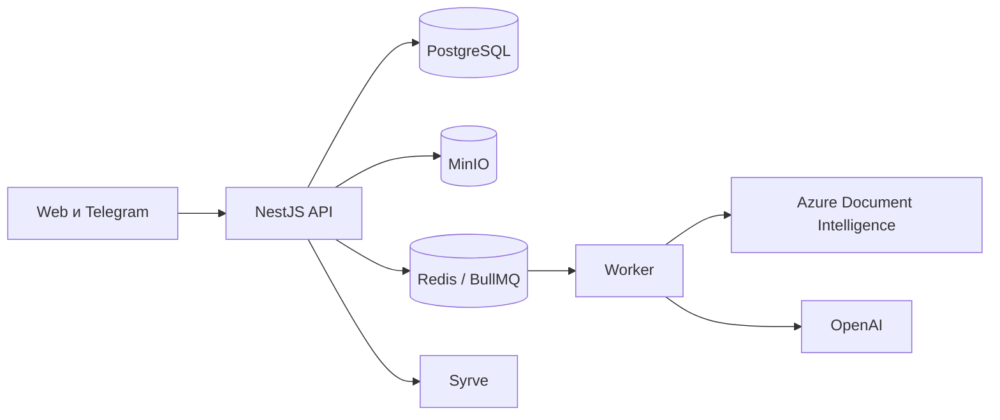

## Поток данных

| Компонент | Назначение |
| --- | --- |
| Next.js Web | Загрузка, просмотр и ручная проверка |
| NestJS API | Авторизация, бизнес-правила, документы и интеграции |
| PostgreSQL / Prisma | Организации, пользователи, документы и попытки |
| MinIO | Оригинальные файлы и вложения |
| Redis / BullMQ | Очередь фоновой обработки |
| Worker | OCR/AI и восстановление обработки |
| Syrve | Конечная система входящих накладных |

## Границы ответственности

- API и worker запускаются отдельными процессами.
- Все бизнес-операции ограничиваются текущей организацией пользователя.
- Оригинальный загруженный файл сохраняется для проверки и аудита.
- Результат OCR/AI остаётся черновиком до проверки человеком.
- Нормальный runtime использует реальные интеграции; тестовый адаптер применяется только в изолированных нагрузочных тестах.

Подробности: `docs/technical-requirements.md` и схема данных `packages/db/prisma/schema.prisma` в репозитории.
